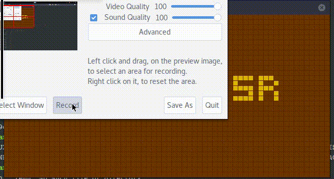

# Building and using

    make

This will create `emu` and `dis` executables. `emu` is emulator and `dis` is
disassembler.  Pass name of the rom you want to start or disassemble as program
argument. Example:

    ./dis games/BRIX

# BRIX

# SYZYGY

# TICTAC

# VBRIX

